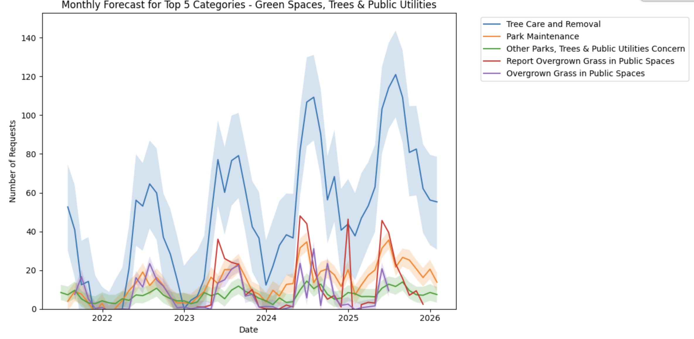
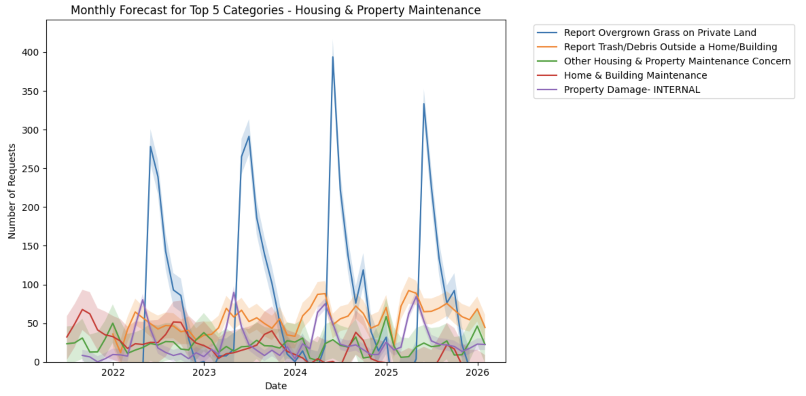
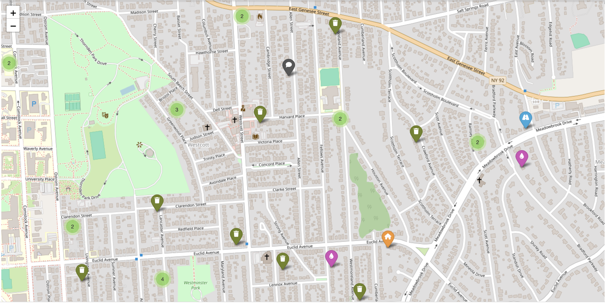

# 📊 City Line Project: Predicting Urban Trends with Data Science

## 🚀 Project Overview  
The **City Line Project** is a data-driven initiative aimed at optimizing **urban management and resource allocation** in **Syracuse, NY**. This project leverages **machine learning and predictive analytics** to analyze **thousands of service requests** related to **waste management, infrastructure, public safety, and property maintenance**.

### 🔍 Key Objectives:  
- **Analyze historical service request data** to identify patterns and trends.  
- **Develop time-series forecasting models** to predict future demand.  
- **Provide actionable insights** for city officials, businesses, and policymakers.  
- **Optimize resource allocation** for better urban management.  

---

## ⚙️ Technologies Used  
- **Programming Language:** Python  
- **Data Processing:** Pandas, NumPy  
- **Machine Learning & Forecasting:** Facebook Prophet, ARIMA, Scikit-learn  
- **Data Visualization:** Matplotlib, Seaborn  
- **Jupyter Notebook** for exploratory data analysis (EDA)  

---

## 📂 Dataset  
- **Source:** City of Syracuse’s public service request data  
- **Time Range:** 2021 - Present  
- **Features Included:**  
  - Request Type (Garbage, Infrastructure, Safety, etc.)  
  - Timestamps (Created, Acknowledged, Closed)  
  - Geographic Location (Latitude, Longitude)  
  - Resolution Time  

---

## 📈 Methodology  

### 1️⃣ Data Preprocessing  
- **Handling missing values** (imputation, removal for key fields)  
- **Feature Engineering** (Extracting time-based features, categorization)  
- **Outlier Detection & Removal**  

### 2️⃣ Exploratory Data Analysis (EDA)  
- **Visualizing request trends over time**  
- **Identifying seasonal peaks in different service categories**  
- **Mapping geographic hotspots for service requests**  

### 3️⃣ Time-Series Forecasting  
- **Facebook Prophet Model** for trend and seasonality detection  
- **ARIMA Model** for short-term forecasting  
- **Moving Averages & Exponential Smoothing** for smoothing request patterns  

### 4️⃣ Insights & Recommendations  
- **Optimized scheduling for waste management (15-20% cost reduction)**  
- **Seasonal property maintenance insights (30% spike in spring/summer)**  
- **Forecasted increase in potholes & parking violations (+25% by 2025)**  
- **Public safety resource allocation based on 12% YoY growth**  

---

## 🛠️ How to Run This Project  

### 🔹 Prerequisites  
Ensure you have **Python 3.x** and install required dependencies:  
```bash
pip install pandas numpy scikit-learn matplotlib seaborn prophet statsmodels jupyter
```

### 🔹 Steps to Run  

1. **Clone this repository**  
   ```bash
   git clone https://github.com/your-repo-name/city-line-project.git
   cd city-line-project
   ```

2. **Install dependencies**  
   ```bash
   pip install -r requirements.txt
   ```

3. **Run Jupyter Notebook**  
   ```bash
   jupyter notebook
   ```

4. **Open the notebook and execute cells**  
   Open `CityLineAnalysis.ipynb` and run the cells step by step.  

---

## 📌 Results & Business Impact  
- **Waste Management Optimization:** Forecasting bulk pickup trends to reduce costs by 15-20%.  
- **Property Maintenance Planning:** Seasonal spikes identified, helping businesses optimize operations.  
- **Infrastructure Planning:** Pothole and parking violation trends assist in budget allocation.  
- **Public Safety Improvements:** Forecasting emergency service demands for better resource distribution.  




[Video](media/Syracuse_City_Line.mp4)

---

## 📢 Let's Connect!  
If you're interested in urban analytics, predictive modeling, or data-driven city planning, feel free to reach out! 🚀  

#### 💼 LinkedIn: [Atharvaa Rane](https://www.linkedin.com/in/atharvaa-rane/)
#### ✉️ Email: atharvaa2014@gmail.com
